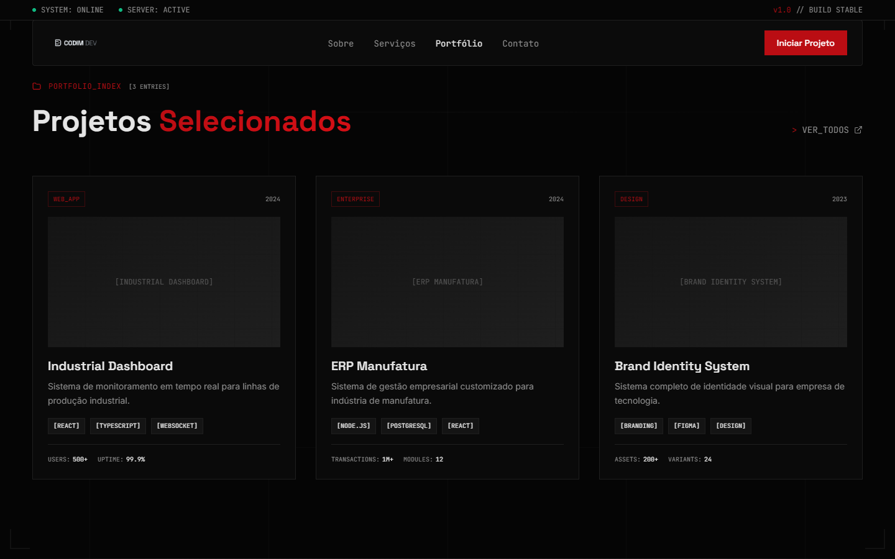
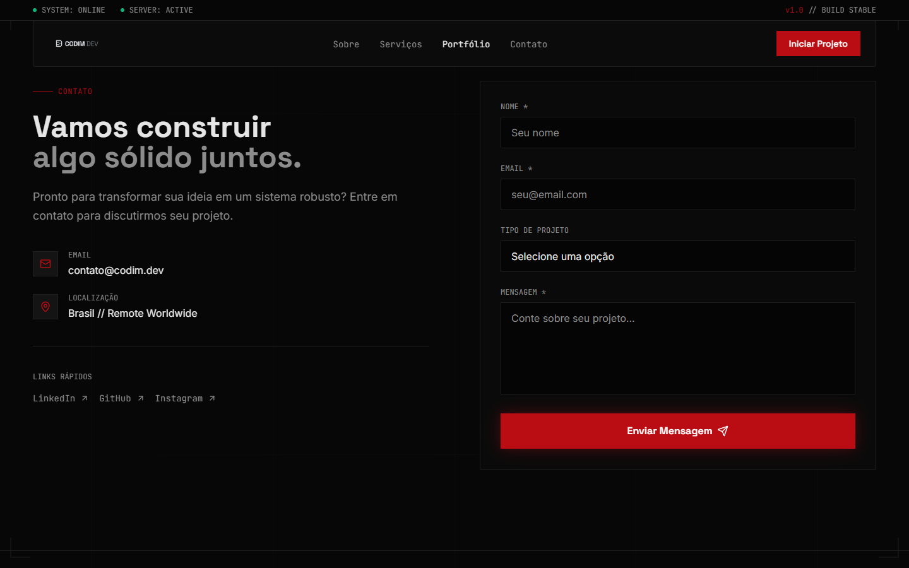

# CODIM DEV | Engenharia de Software & Sistemas Inteligentes


> "Projetamos sistemas robustos que resistem ao tempo e à escala. Arquitetura precisa. Código limpo. Resultados sólidos."

Este repositório contém o código-fonte do website oficial da **CODIM DEV**, uma plataforma moderna desenvolvida para apresentar serviços de engenharia de software, portfólio e soluções de alta tecnologia.

## 📸 Screenshots

Para ilustrar a experiência visual do projeto, adicione capturas de tela aqui.

### Home / Hero Section


_Visualização inicial com animações e identidade visual._

### Portfólio


_Seção de projetos e cases de sucesso._

### Contato


_Formulário de contato e informações de localização._

> **Nota:** As imagens acima são placeholders. Por favor, adicione as capturas de tela na pasta `screenshots` (crie-a na raiz se necessário) ou atualize os caminhos.

## 🚀 Tecnologias Utilizadas

O projeto foi construído utilizando um stack moderno e performático:

- **Core:** [React](https://react.dev/) + [Vite](https://vitejs.dev/) + [TypeScript](https://www.typescriptlang.org/)
- **Estilização:** [Tailwind CSS](https://tailwindcss.com/)
- **UI Components:** [Shadcn UI](https://ui.shadcn.com/) (baseado em Radix UI)
- **Animações:** [Framer Motion](https://www.framer.com/motion/)
- **Ícones:** [Lucide React](https://lucide.dev/)
- **Roteamento:** [React Router DOM](https://reactrouter.com/)
- **Gerenciamento de Estado/Data:** [TanStack Query](https://tanstack.com/query/latest)
- **Validação de Formulários:** [React Hook Form](https://react-hook-form.com/) + [Zod](https://zod.dev/)

## 🛠️ Instalação e Execução

Siga os passos abaixo para rodar o projeto localmente:

### Pré-requisitos

- Node.js (versão 18 ou superior recomendada)
- npm ou yarn

### Passo a Passo

1. **Clone o repositório:**

   ```bash
   git clone https://github.com/seu-usuario/obsidian-console.git
   cd obsidian-console-main
   ```

2. **Instale as dependências:**

   ```bash
   npm install
   # ou
   yarn
   ```

3. **Inicie o servidor de desenvolvimento:**

   ```bash
   npm run dev
   # ou
   yarn dev
   ```

4. **Acesse no navegador:**
   O projeto estará rodando em `http://localhost:8080` (ou outra porta indicada no terminal).

## 📂 Estrutura do Projeto

```
src/
├── assets/          # Imagens, logos e recursos estáticos
├── components/      # Componentes React reutilizáveis
│   ├── ui/          # Componentes base (Shadcn UI)
│   └── ...          # Componentes de seção (Header, Hero, Footer, etc.)
├── hooks/           # Custom React Hooks
├── lib/             # Utilitários e configurações (utils.ts)
├── pages/           # Páginas da aplicação (Index, NotFound)
└── App.tsx          # Componente raiz e configuração de rotas
```

## ✨ Funcionalidades Principais

- **Design Responsivo:** Adaptável a todos os tamanhos de tela (Mobile, Tablet, Desktop).
- **Animações Fluidas:** Uso de Framer Motion para transições suaves e interações ricas.
- **Tema Dark/Futurista:** Identidade visual inspirada em consoles e sistemas "obsidian".
- **Performance:** Otimizado com Vite para carregamento rápido.

## 📄 Licença

Este projeto é proprietário e pertence à **CODIM DEV**. Todos os direitos reservados.

---

Desenvolvido com 💻 por **CODIM DEV Team**.
