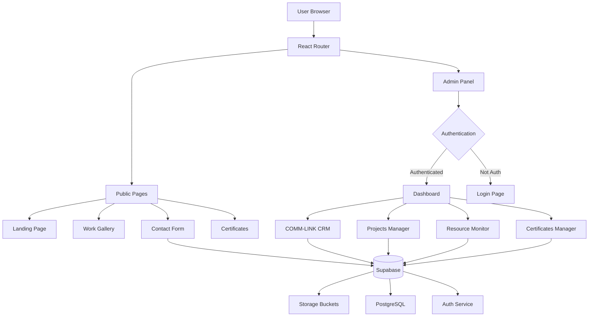
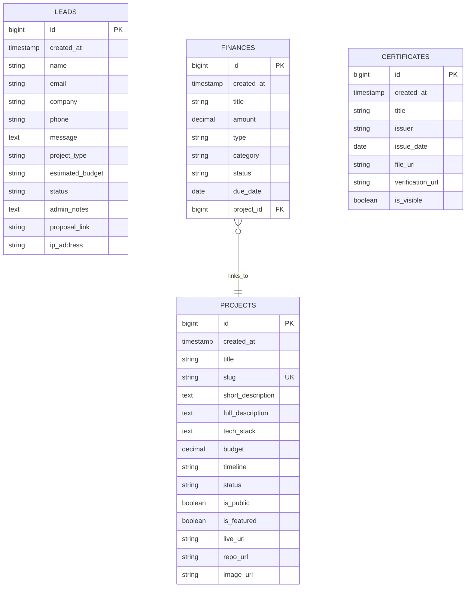
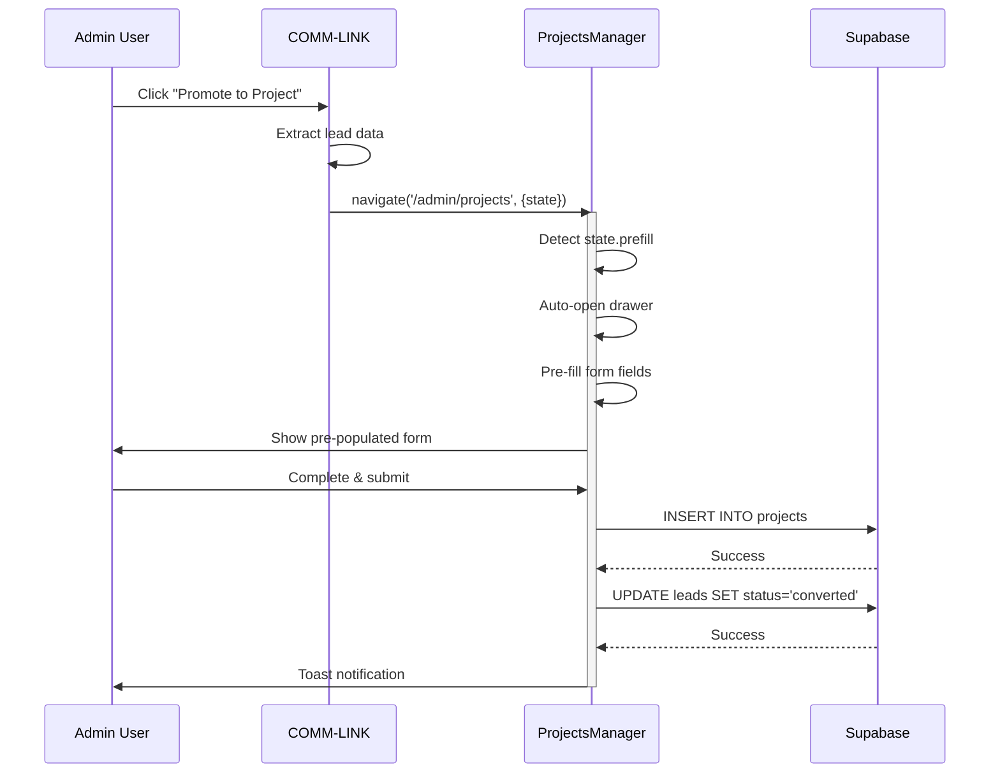
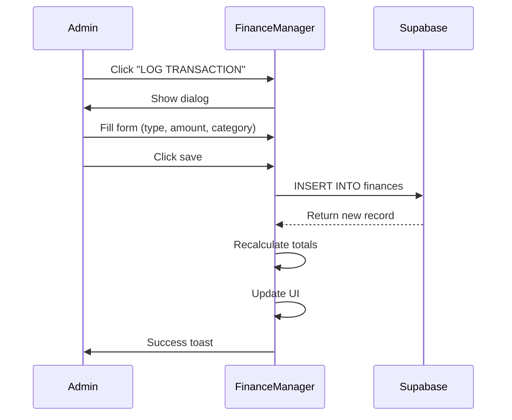

# Architecture Documentation

> System design, data flows, and technical implementation details for Obsidian Console.

---

## 📐 System Overview

Obsidian Console is a **full-stack React application** with a clear separation between public portfolio and admin panel functionalities.



---

## 🏗️ Frontend Architecture

### Component Hierarchy

```
App (Router)
├── Public Routes
│   ├── Layout
│   │   ├── Header (Navigation)
│   │   ├── Page Content
│   │   └── Footer
│   └── Pages
│       ├── Home
│       ├── Work
│       ├── Contact
│       └── Certificates
│
└── Admin Routes
    ├── AdminLayout
    │   ├── Sidebar (Navigation)
    │   ├── Header (User info)
    │   └── Main Content
    └── Pages
        ├── Dashboard
        ├── CommLink (CRM)
        ├── ProjectsManager
        ├── FinanceManager
        ├── CertificatesManager
        └── Settings
```

### State Management Strategy

**Local State (useState):**
- Form inputs
- Modal open/close
- Filter selections
- UI toggles

**Server State (Supabase):**
- Projects data
- Leads data
- Finances data
- Certificates data

**No Global State Library:**
- Props drilling for shared state
- React Context for auth (future enhancement)

---

## 🗄️ Database Schema

### Entity Relationship Diagram



### Tables Detail

#### **projects**
Purpose: Store portfolio projects (public + private)

| Column | Type | Constraints | Description |
|--------|------|-------------|-------------|
| id | bigint | PK, auto-increment | Unique identifier |
| created_at | timestamptz | NOT NULL, default now() | Creation timestamp |
| title | text | NOT NULL | Project name |
| slug | text | UNIQUE, NOT NULL | URL-friendly identifier |
| short_description | text | | Brief summary (1-2 lines) |
| full_description | text | | Detailed markdown description |
| tech_stack | text[] | | Array of technologies used |
| budget | numeric | | Project budget amount |
| timeline | text | | Duration (e.g., "3 months") |
| status | text | CHECK | planning, in_progress, review, completed |
| is_public | boolean | default false | Show on public portfolio |
| is_featured | boolean | default false | Highlight on homepage |
| live_url | text | | Live demo link |
| repo_url | text | | GitHub repository |
| image_url | text | | Screenshot/thumbnail |

**Indexes:**
- `idx_projects_slug` on `slug`
- `idx_projects_status` on `status`
- `idx_projects_public` on `is_public WHERE is_public = true`

#### **leads**
Purpose: CRM for tracking potential clients

| Column | Type | Constraints | Description |
|--------|------|-------------|-------------|
| id | bigint | PK, auto-increment | Unique identifier |
| created_at | timestamptz | NOT NULL, default now() | Lead arrival time |
| name | text | NOT NULL | Contact name |
| email | text | NOT NULL | Contact email |
| company | text | | Organization name |
| phone | text | | WhatsApp/phone number |
| message | text | | Initial inquiry message |
| project_type | text | | landing_page, webapp, ecommerce, etc. |
| estimated_budget | text | | Budget range |
| status | text | CHECK, default 'new' | new, contacted, negotiating, converted, archived |
| admin_notes | text | | Internal annotations |
| proposal_link | text | | Quote/proposal document URL |
| ip_address | text | | For spam prevention |

**Indexes:**
- `idx_leads_status` on `status`
- `idx_leads_created` on `created_at DESC`

#### **finances**
Purpose: Income and expense tracking

| Column | Type | Constraints | Description |
|--------|------|-------------|-------------|
| id | bigint | PK, auto-increment | Unique identifier |
| created_at | timestamptz | NOT NULL, default now() | Transaction time |
| title | text | NOT NULL | Description |
| amount | numeric | NOT NULL | Value (positive/negative) |
| type | text | CHECK | income, expense |
| category | text | | project, server, software, salary, tax |
| status | text | CHECK, default 'paid' | paid, pending, scheduled |
| due_date | date | | Payment/due date |
| project_id | bigint | FK → projects(id) | Optional project link |

**Indexes:**
- `idx_finances_type` on `type`
- `idx_finances_status` on `status`
- `idx_finances_created` on `created_at DESC`

---

## 🔒 Security Model

### Row Level Security (RLS) Policies

```sql
-- Projects: Public read, Admin full access
CREATE POLICY "Public can view published projects"
  ON projects FOR SELECT
  USING (is_public = true);

CREATE POLICY "Admin manages all projects"
  ON projects FOR ALL
  TO authenticated
  USING (true);

-- Leads: Admin only
CREATE POLICY "Admin manages leads"
  ON leads FOR ALL
  TO authenticated
  USING (true);

-- Finances: Admin only
CREATE POLICY "Admin manages finances"
  ON finances FOR ALL
  TO authenticated
  USING (true);
```

### Storage Policies

```sql
-- Projects bucket: Public read, Authenticated write
CREATE POLICY "Public read access"
  ON storage.objects FOR SELECT
  USING (bucket_id = 'projects');

CREATE POLICY "Authenticated upload"
  ON storage.objects FOR INSERT
  TO authenticated
  WITH CHECK (bucket_id = 'projects');
```

---

## 🔄 Data Flow Patterns

### Lead to Project Conversion



### Transaction Logging (Finance)



---

## 🎨 Design Tokens

### Color System

```typescript
const colors = {
  // Base
  background: '#050505',
  surface: '#0A0A0A',

  // Accents
  crimson: '#BA0C10',
  cyan: '#00D9FF',
  green: '#00FF88',
  orange: '#FF6B00',

  // Status
  success: '#10B981',
  warning: '#F59E0B',
  error: '#EF4444',
  info: '#3B82F6',

  // Neutrals
  white: '#FFFFFF',
  'white/90': 'rgba(255, 255, 255, 0.9)',
  'white/50': 'rgba(255, 255, 255, 0.5)',
  'white/10': 'rgba(255, 255, 255, 0.1)',
}
```

### Typography Scale

```typescript
const typography = {
  display: 'font-display font-bold tracking-tight',
  heading: 'font-sans font-semibold',
  body: 'font-sans font-normal',
  mono: 'font-mono tracking-wide',

  sizes: {
    xs: 'text-xs',      // 12px
    sm: 'text-sm',      // 14px
    base: 'text-base',  // 16px
    lg: 'text-lg',      // 18px
    xl: 'text-xl',      // 20px
    '2xl': 'text-2xl',  // 24px
    '4xl': 'text-4xl',  // 36px
  }
}
```

---

## 🚀 Performance Optimizations

### Implemented
- ✅ Lazy loading for images
- ✅ Debounced search inputs
- ✅ Optimistic UI updates
- ✅ Indexed database queries
- ✅ Vite code splitting

### Future Enhancements
- [ ] React Query for caching
- [ ] Virtual scrolling for large lists
- [ ] Service Worker for offline support
- [ ] Image CDN integration

---

## 🔌 API Integration Points

### Supabase Client Configuration

```typescript
import { createClient } from '@supabase/supabase-js'

const supabaseUrl = import.meta.env.VITE_SUPABASE_URL
const supabaseKey = import.meta.env.VITE_SUPABASE_ANON_KEY

export const supabase = createClient(supabaseUrl, supabaseKey)
```

### Common Query Patterns

**Fetch all projects (public):**
```typescript
const { data } = await supabase
  .from('projects')
  .select('*')
  .eq('is_public', true)
  .order('created_at', { ascending: false })
```

**Fetch leads with filtering:**
```typescript
const { data } = await supabase
  .from('leads')
  .select('*')
  .eq('status', 'new')
  .order('created_at', { ascending: false })
```

**Insert transaction:**
```typescript
const { error } = await supabase
  .from('finances')
  .insert({
    title: 'Project Payment',
    amount: 5000,
    type: 'income',
    status: 'paid'
  })
```

---

## 📦 Deployment Architecture

### Build Process

```bash
npm run build
# Output: dist/
# - index.html
# - assets/
#   - index-[hash].js
#   - index-[hash].css
```

### Hosting Options

| Platform | Pros | Setup |
|----------|------|-------|
| **Vercel** | Auto deploys, Edge functions | Connect GitHub repo |
| **Netlify** | Forms, Edge functions | Drop `dist/` folder |
| **Railway** | Full backend support | Docker or buildpack |

### Environment Variables (Production)

```env
VITE_SUPABASE_URL=https://your-project.supabase.co
VITE_SUPABASE_ANON_KEY=your-anon-key
```

---

## 🧪 Testing Strategy

### Current Coverage
- Manual testing for all CRUD operations
- Browser testing for responsive design
- Supabase migration testing

### Planned Testing
- [ ] Unit tests with Vitest
- [ ] Component tests with React Testing Library
- [ ] E2E tests with Playwright
- [ ] Visual regression tests

---

## 📈 Scalability Considerations

### Database
- Current: Single Supabase project
- Future: Read replicas, connection pooling

### Frontend
- Current: Client-side rendering
- Migration path: Next.js for SSR/SSG

### Storage
- Current: Supabase Storage (5GB free)
- Future: Cloudinary/Imgix for optimization

---

## 🔍 Monitoring & Observability

### Metrics to Track
- Page load times
- API response times
- Error rates
- User conversion funnel (public → lead → project)

### Tools (Planned)
- Sentry for error tracking
- PostHog for analytics
- Supabase built-in metrics

---

## 📚 Additional Resources

- [Supabase Docs](https://supabase.com/docs)
- [React Router v6](https://reactrouter.com/en/main)
- [Tailwind CSS](https://tailwindcss.com/docs)
- [Shadcn UI](https://ui.shadcn.com/)

---

<div align="center">
  <strong>Architecture v1.0 | Last updated: 2026-01-28</strong>
</div>
